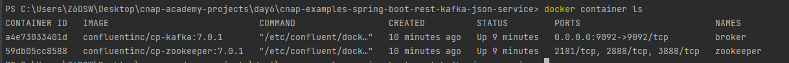
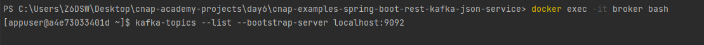
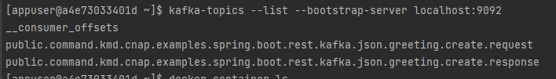
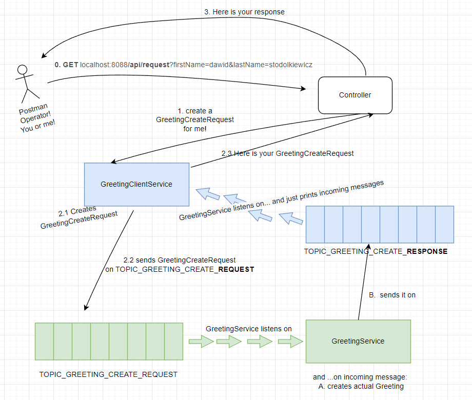
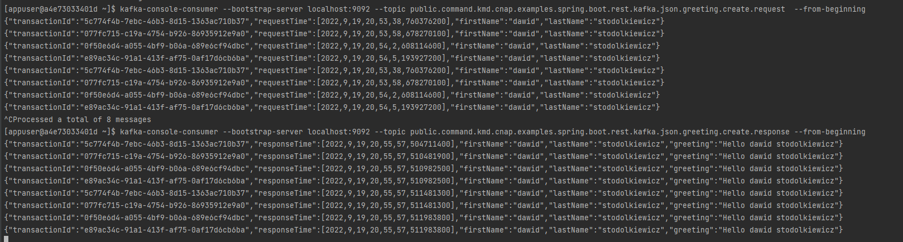
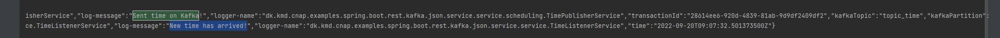
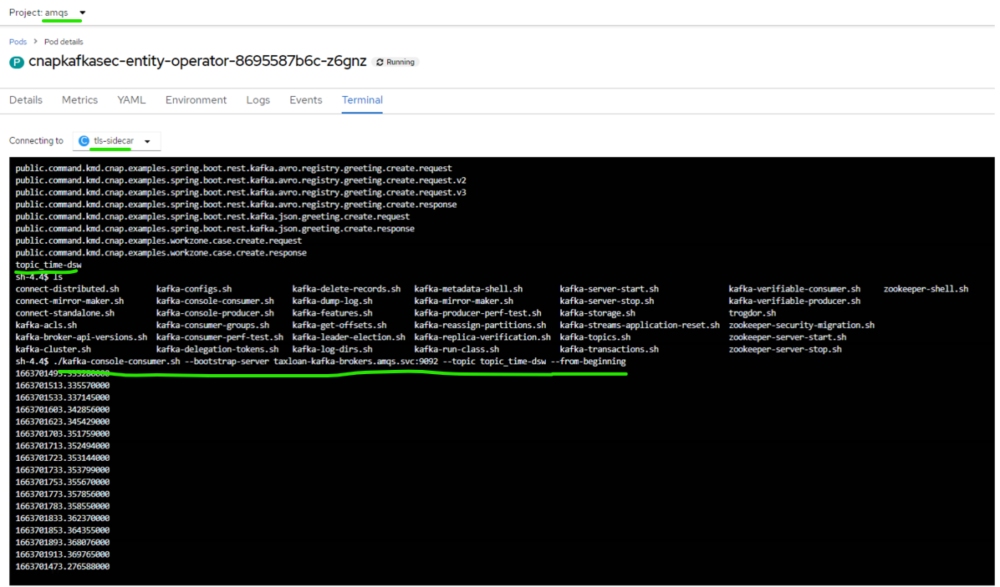

# Kafka 101

## Setup
To start kafka broker and zookeeper:
```
docker compose up
```
Two docker containers will be created:


## Commands & CLI

### To be able to run some kafka CLI, run:
```
docker exec -it broker bash
```

### Check what kafka topics do exist currently:
```
kafka-topics --list --bootstrap-server localhost:9092
```

### Example:
#### Before starting the application


#### After starting the application


### Useful CLI commands
#### Check what's on our topics
```
kafka-console-consumer --bootstrap-server localhost:9092 --topic public.command.kmd.cnap.examples.spring.boot.rest.kafka.json.greeting.create.request  --from-beginning
kafka-console-consumer --bootstrap-server localhost:9092 --topic public.command.kmd.cnap.examples.spring.boot.rest.kafka.json.greeting.create.response --from-beginning
```
### What happens in /api/request?


After 8 POSTMAN requests, that's how our topics could look like:
#### Example:


## Extra task
Make a new repo. Add a time topic, and a service that publishes the current time every 10s. Add a consumer, that reads the time and prints to the log what time it is.

### What was added?
TimePublisherService - publishes the current time every 10s to TOPIC_TIME   
TimeListenerService - listens on TOPIC_TIME and prints to the log what time it is

3 new beans have been created in KafkaConfig class:
- a bean to create new topic programmatically
- a bean returning ConcurrentKafkaListenerContainerFactory<String, Instant>
- a bean creating a producer - KafkaProducer<String, Instant>

### Does it work locally?

yes

### Does it work on kafka on Openshift?

yes